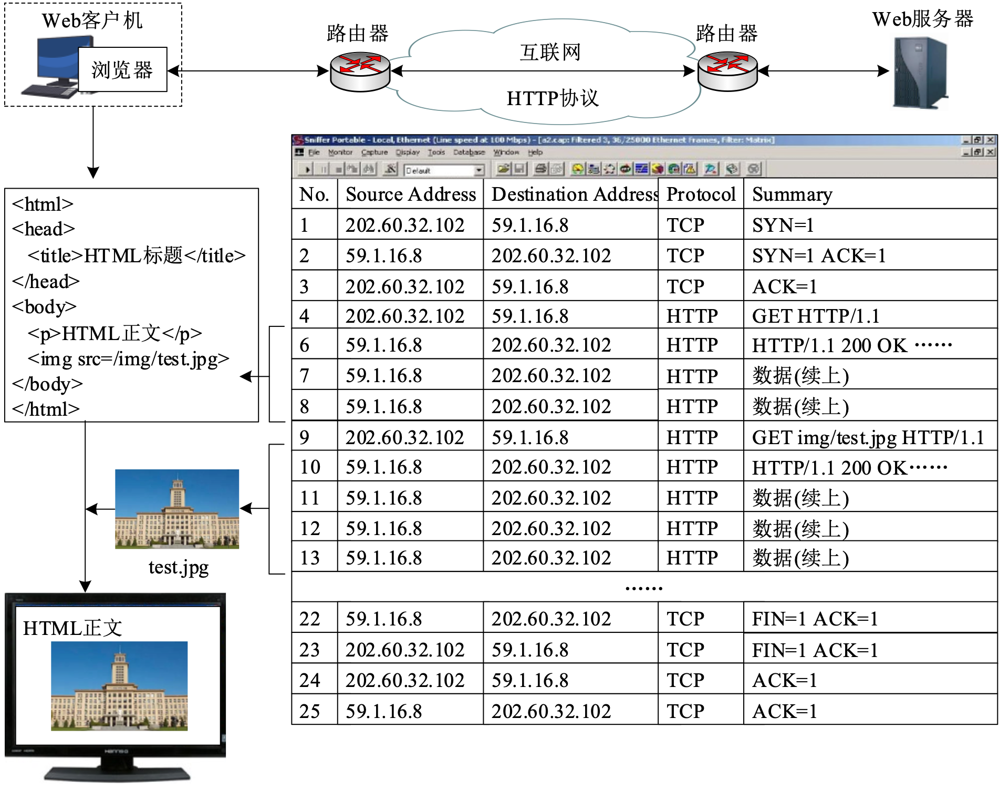
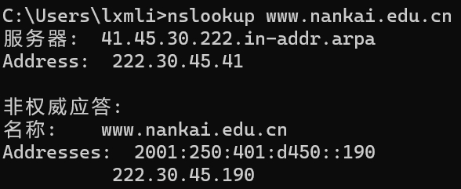

# 
**计算机网络实验报告**

## 
第 1 次书面作业

## 
 **网络空间安全学院 信息安全专业**

## 
 **2112492 刘修铭 1063**

# 习题 1

网络结构如下图所示，主机 $A$ 与主机 $B$ 之间通过 $3$ 段链路和 $2$ 台转发设备（$R1$ 与 $R2$）进行连接，每条链路的长度和传输速率在图中标出，$R1$ 与 $R2$ 采用存储转发机制，主机 $A $ 向主机 $B$ 发送一个长度为 $6000$ 字节的报文。设电磁波传播速度为 $2×10^8$ 米/秒，忽略报文在 $R1$ 与 $R2$ 中路由决策与排队的延时。请回答以下 $3$ 个问题：

1. **如果采用报文交换，请计算报文传输的最小端到端延时（从主机 $A$ 传输报文第一位开始，到主机 $B$ 接收到报文最后一位为止所用的时间）（15 分）**
   $$
   \begin{align}
   & t_1 = \frac{6000 \times 8 \times 10^3}{100\times 10^6}+\frac{1\times 10^3 \times 10^3}{2\times 10^8}\\
   & t_2 = \frac{6000 \times 8 \times 10^3}{1\times 10^9}+ \frac{20\times 10^3 \times 10^3}{2\times 10^8}\\
   & t_3 = \frac{6000 \times 8 \times 10^3}{100\times 10^6}+ \frac{0.5\times 10^3 \times 10^3}{2\times 10^8}\\
   & t = t_1 + t_2 + t_3 = 1.1155 \ ms
   \end{align}
   $$
   
2. **如果将报文分成 $4$ 个分组依次传输，请计算完成报文传输的最小端到端延时（忽略报文封装成分组的开销）（15 分）**
   $$
   \begin{align}
   & t_1 = \frac{1}{4} \times \frac{6000 \times 8 \times 10^3}{100\times 10^6}+\frac{1\times 10^3 \times 10^3}{2\times 10^8}\\
   & t_2 = \frac{1}{4} \times \frac{6000 \times 8 \times 10^3}{1\times 10^9}+ \frac{20\times 10^3 \times 10^3}{2\times 10^8}\\
   & t_3 = \frac{6000 \times 8 \times 10^3}{100\times 10^6}+ \frac{0.5\times 10^3 \times 10^3}{2\times 10^8}\\
   & t = t_1 + t_2 + t_3 = 0.7195 \ ms
   \end{align}
   $$

3. **在统计多路复用机制中，端到端延时具有不确定性，请简要分析影响端到端延时的主要因素（20 分）**

   端到端延时的不确定性是多个因素共同作用的结果。

   * **处理时延**：主机或路由器在接收和转发数据时，需要进行一些处理操作，如检查分组的错误、确定分组的输出链路等。以上操作进行时会产生一定的处理时延。
   * **网络设备性能**：**处理时延**的处理能力会受到网络设备性能的影响。每个节点的处理能力和负载的不同都会导致处理能力的不同，进而影响端到端时延。
   * **传输时延**：每个节点在将分组从输入链路发送到输出链路时，需要花费一定的时间，该时间则取决于报文分组的长度、数量以及链路的带宽。
   * **传播时延**：分组从一个节点传播到另一个节点时，需要花费一定的时间，该时间则取决于链路的长度以及链路的传输速率（受网络质量影响）。
   * **网络质量**：当网络拥塞时，数据包在传输过程中会遇到队列延迟，导致数据包在传输路径中停滞。当网络中干扰较多导致数据丢包时，需要进行重传等操作，使得时延增加。而网络带宽较小时，会限制数据包的传输，压低传输速率，进而增加时延。
   * **排队时延**：每个节点的输出链路可能有多个分组等待传输，这些分组需要在输出缓冲区中排队，直到轮到它们被发送，而该时延则取决于网络的拥塞程度与分组到达的顺序等因素。
   * **路由决策**：在数据包传输中，其可能会经过多个路由器及链路，由于路由设备与链路的状态处于动态变化中，会导致端到端时延处于不稳定状态。

   以上仅列出部分因素，其他因素在此不一一列举。

   

# 习题 2

浏览器访问 $Web$ 服务器的报文交互过程如下图所示。请回答以下 $4$ 个问题：

1. **浏览器与 $Web$ 服务器所在主机的 $IP$ 地址分别是什么？（8 分）**
   * 浏览器——202.60.32.102
   * Web 服务器——59.1.16.8

2. **报文 $1～3$ 的整体用途是什么？每个报文的具体用途？（8 分）**

   **整体用途**是 TCP 协议用来建立连接，即三次握手建立连接。

   1. 第一次握手：建立连接时，浏览器发送 SYN 到 Web 服务器，并进入 SYN_SENT 状态，等待 Web 服务器确认。
      * 第一次握手成功说明浏览器的数据可以被 Web 服务器收到，说明浏览器的发功能可用，说明 Web 服务器的收功能可用。但浏览器自己不知道数据是否被接收
   2. 第二次握手：浏览器收到请求后，回送 SYN + ACK 信令到 Web 服务器，此时 Web 服务器进入 SYN_RECV 状态。
      * 第二次握手成功说明 Web 服务器的数据可以被浏览器收到，说明 Web 服务器的发功能可用，说明浏览器的收功能可用。同时浏览器知道自己的数据已经正确到达 Web 服务器，自己的发功能正常。但是 Web 服务器自己不知道数据是否被接收
   3. 第三次握手：浏览器收到 SYN + ACK 包，向 Web 服务器发送确认 ACK 包，浏览器进入 ESTABLISHED 状态，Web 服务器收到请求后也进入 ESTABLISHED 状态，完成三次握手，此时 TCP 连接成功，浏览器与 Web 服务器开始传送数据。
      * 第三次握手成功说明 Web 服务器知道自己的数据已经正确到达浏览器，自己的发功能正常。**至此连接成功建立**

3. **图中哪些报文是 $HTTP$ 请求报文？每个报文的具体用途？（8 分）**

   图中序号为 4 和 9 的报文为 HTTP 请求报文。 

   * 序号为 4 的报文用来向 Web 服务器发送 GET 请求，使用 HTTP/1.1 协议。结合下文可以推知，此处的请求用于请求 html 文件的内容。
     * 序号为 6、7、8 的报文为其响应报文，状态码 200 表示请求成功，其响应体为请求的 html 文件的内容。
   * 序号为 9 的报文用来向 Web 服务器发送 GET 请求，请求的内容为 img/test.jpg，使用 HTTP/1.1 协议。
     * 序号为 10、11、12、13 的报文为其响应报文，状态码 200 表示请求成功，其响应体为请求的  img/test.jpg 文件。

4. **使用 $Windows$ 命令行模式提供的 $nslookup$ 命令查询 $www.nankai.edu.cn$ 的 $IP$ 地址，给出结果截图，并对返回的结果进行解释。（26 分）**

   使用 nslookup 命令查询其 IP 地址，可以得到如下结果：

   

   * **41.45.30.22.in-addr.arpa** 是本地 DNS 服务器，其 IP 地址为 222.30.45.41。

   * **非权威应答**表示 DNS 服务器返回的信息并非该域名的官方记录，而是从其他 DNS 服务器中获取的缓存信息或者其他非官方来源的数据。这种情况通常发生在本地 DNS 服务器向其他 DNS 服务器查询域名信息时，获取到的答案被标记为“非权威应答”。

   * **名称: www.nankai.edu.cn** 为题干给定 url 查询所涉及的主机名。

   * 接着的两个 **Addresses** 表示题干给定的 url 有两个 IP 地址：
     * **2001:250:401:d450::190** 为其 IPv6 地址；
     * **222.30.45.190** 为其 IPv4 地址。
