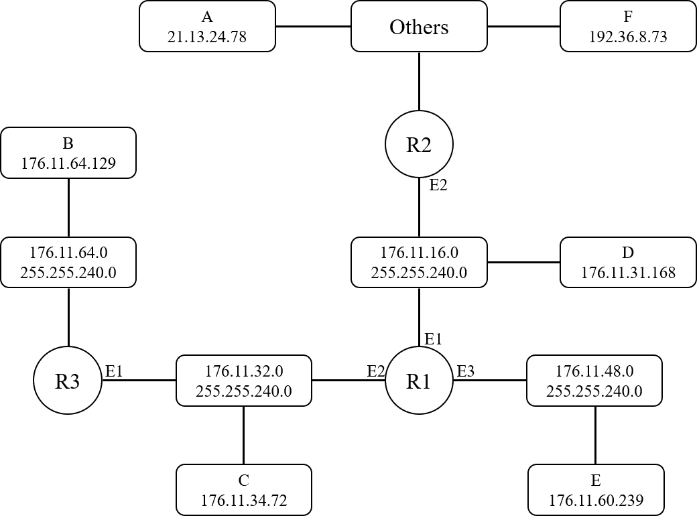
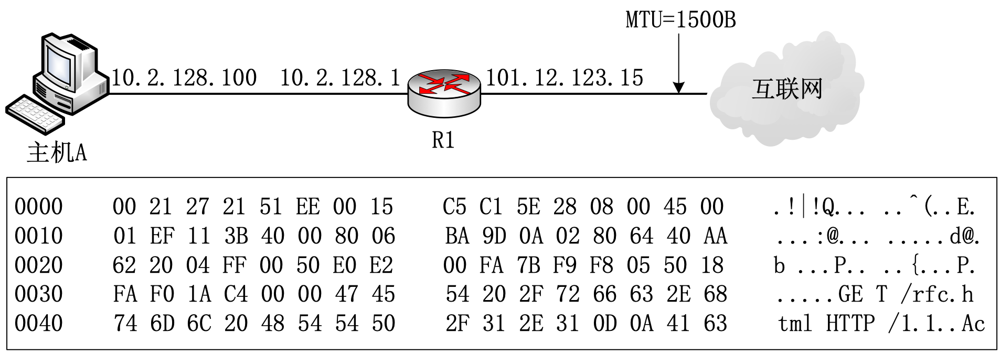

# 
**计算机网络实验报告**

## 
第 2 次书面作业

## 
 **网络空间安全学院 信息安全专业**

## 
 **2112492 刘修铭 1063**

# 习题 1

路由器 $R1$ 的路由表如下表所示。主机 $A$ 的 $IP$ 地址为 $21.13.24.78$，主机 $B$ 的 $IP$ 地址为 $176.11.64.129$，主机 $C$ 的 $IP$ 地址为 $176.11.34.72$；主机 $D$ 的 $IP$ 地址为 $176.11.31.168$，主机 $E$ 的 $IP$ 地址为 $176.11.60.239$，主机 $F$ 的 $IP$ 地址为 $192.36.8.73$。路由器 $R1$ 接收到分别发送到目的主机（主机 $A$ ~ 主机 $F$）的分组。请回答以下 $3$ 个问题：

|   网络地址    |    子网掩码     |    下一跳    | 转发端口 |
| :-----------: | :-------------: | :----------: | :------: |
| $176.11.64.0$ | $255.255.240.0$ | $R3$ 的 $E1$ |   $E2$   |
| $176.11.16.0$ | $255.255.240.0$ |      -       |   $E1$   |
| $176.11.32.0$ | $255.255.240.0$ |      -       |   $E2$   |
| $176.11.48.0$ | $255.255.240.0$ |      -       |   $E3$   |
|   $0.0.0.0$   |    $0.0.0.0$    | $R2$ 的 $E2$ |   $E1$   |

1. **根据 $R1$ 的路由表信息推断并绘制出网络结构图。（22 分）**

   

2. **如果 $R3$ 的 $E1$ 与 $R2$ 的 $E2$ 的 $IP$ 地址主机号均为 $5$，那么这两个端口的 $IP$ 地址是什么？（10 分）**

   * **R3  的 E1**：176.11.32.5

   * **R2 的 E2**：176.11.16.5

3. **对于目的地址为主机 $A$ ~ 主机 $F$ 的分组，它们的下一跳地址分别是什么？（18 分）**
   * **A**：R2 的 E2，即**题目 2** 中的 176.11.16.5
   * **B**：R3 的 E1，即**题目 2** 中的 176.11.32.5
   * **C**：直接投递，R1 的 E2
   * **D**：直接投递，R1 的 E1
   * **E**：直接投递，R1 的 E3
   * **F**：R2 的 E2，即**题目 2** 中的 176.11.16.5

# 习题 2

网络结构如下图所示。主机 $A$ 的 $MAC$ 地址为 $00-15-C5-C1-5E-28$，$IP$ 地址为 $10.2.128.100$（私有地址），下方框中为该主机进行 $Web$ 请求的 $1$ 个以太网数据帧前 $80B$ 的十六进制及 $ASCII$ 码内容。请回答以下 $4$ 个问题：

1. **$Web$ 服务器的 $IP$ 地址是什么？该主机的默认网关的 $MAC$ 地址是什么？（10 分）**
   * **IP**：40.AA.62.20，即 64.170.98.32
   * **MAC**：00-21-27-21-51-EE

2. **该主机在构造上图的数据帧时，使用什么协议确定目的 $MAC$ 地址？封装该协议请求报文的以太网帧的目的 $MAC$ 地址是什么？（10 分）**

   使用 ARP 协议确定目的 MAC 地址。

   目的 MAC 地址为广播地址：FF-FF-FF-FF-FF-FF。

3. **假设 $HTTP/1.1$ 协议以持续的非流水线方式工作，一次请求/响应时间为 $RTT$，$rfc.html$ 页面引用了 $5$ 个 $JPG$ 图像，则从发出上图中的 $Web$ 请求开始到浏览器收到全部内容为止，需要经过多少个 $RTT$？（15 分）**

   需要经过 **6** 个 RTT

   * 获取 rfc.html 页面需要经过 1 个 RTT。
   * 获取其引用的 5 个 JPG 图像需要经过 5 个 RTT。

4. **该帧所封装的 $IP$ 分组经过路由器 $R1$ 转发时，需修改 $IP$ 分组首部中的哪些字段？（15 分）**

   * 源 IP 地址 0A.02.80.64 改为 65.0C.7B.0F（即 101.12.123.15）；
   * 生存时间 TTL 减去 1；
   * 重新计算校验和；
   * 如果 IP 分组的长度大于 MTU，则总长度字段、标志字段、片偏移字段也要发生变化。
